## 시퀀스 다이어그램

### 순서

```
1. 회원(Member)
2. 게시판(article)
3. 프로필(profile)
4. 친구(Friend)
5. 스터디 그룹(studygroup)
6. 그룹 피드(groupfeed)
```

<br/>

## 회원(Member)

### Member - 회원가입

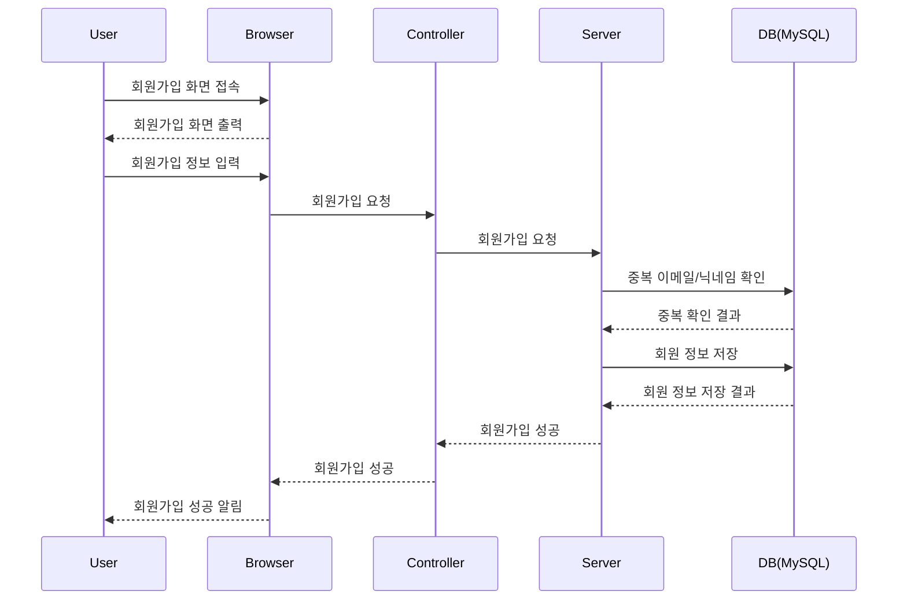

<br/>

### Member - 로그인

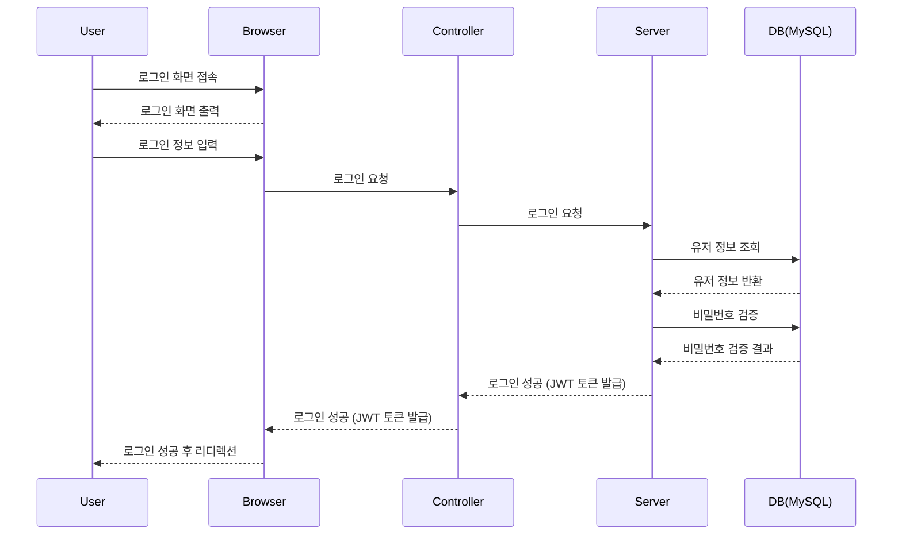

<br/>


### Member - 비밀번호 재설정

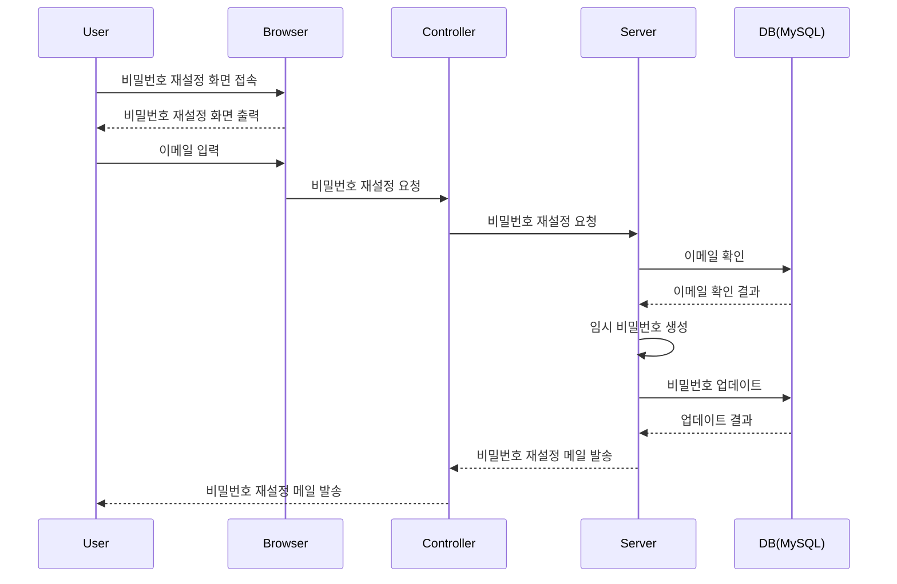


<br/>


### Member - 회원 정보 수정

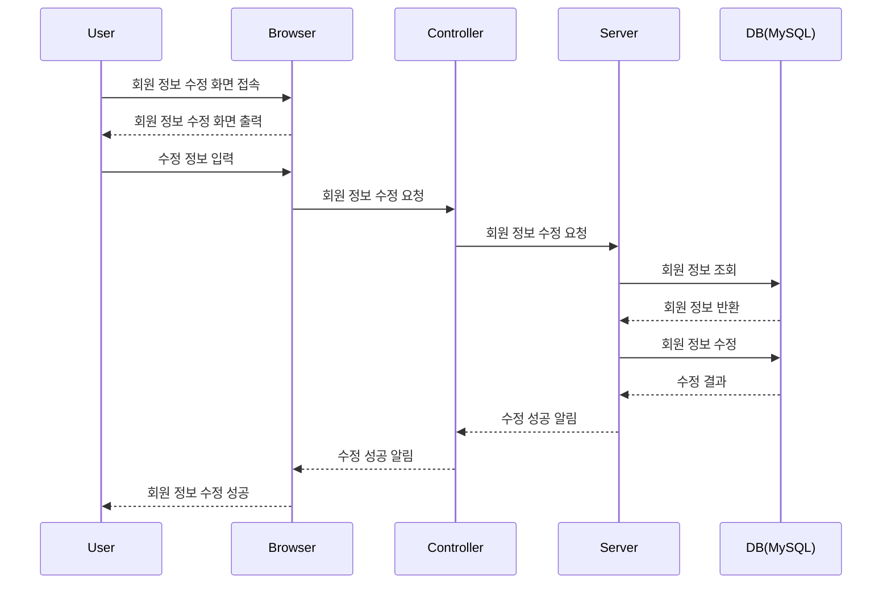


<br/>


### Member - 회원 탈퇴

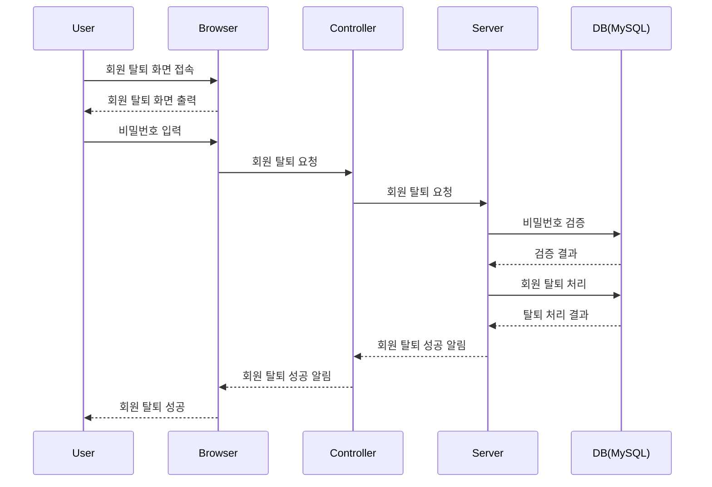

<br/><br/>

## article

### article - 게시글 목록

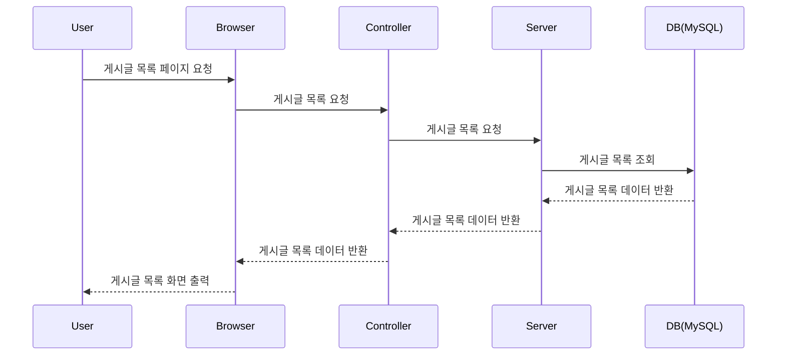

<br/>

### article - 게시글 상세보기

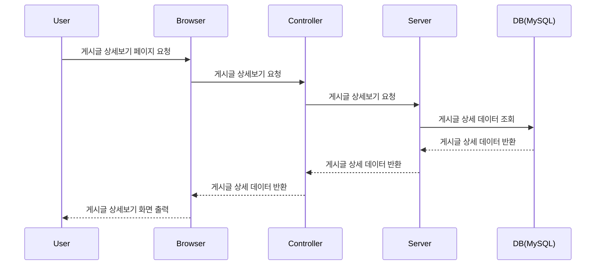

<br/>

### article - 게시글 저장

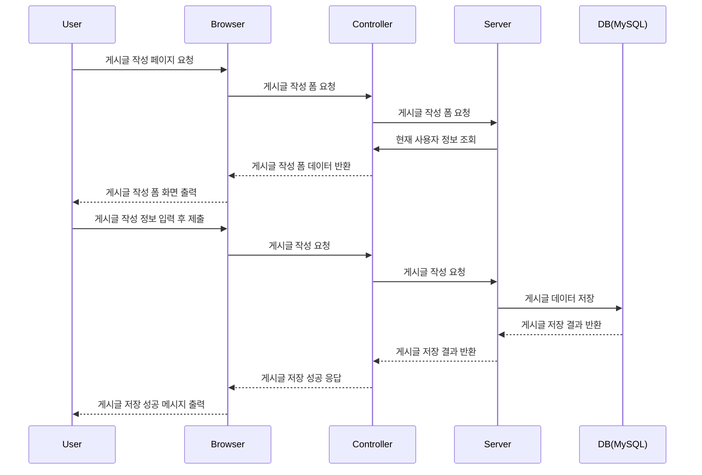


<br/>

### article - 게시글 수정

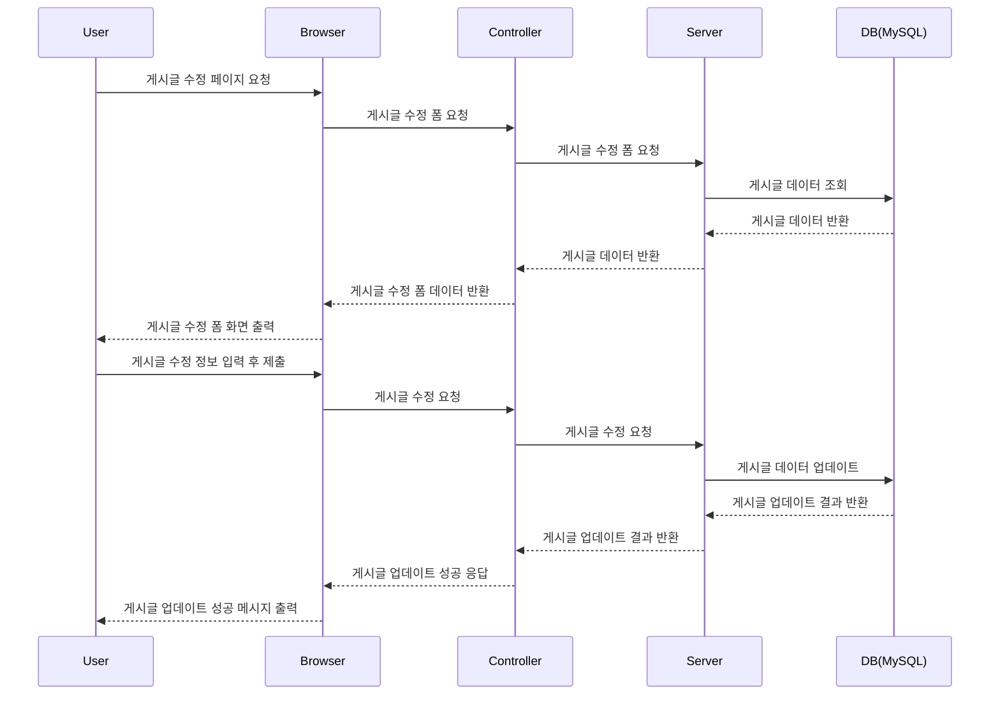

<br/><br/>

## profile

### profile - 프로필 조회

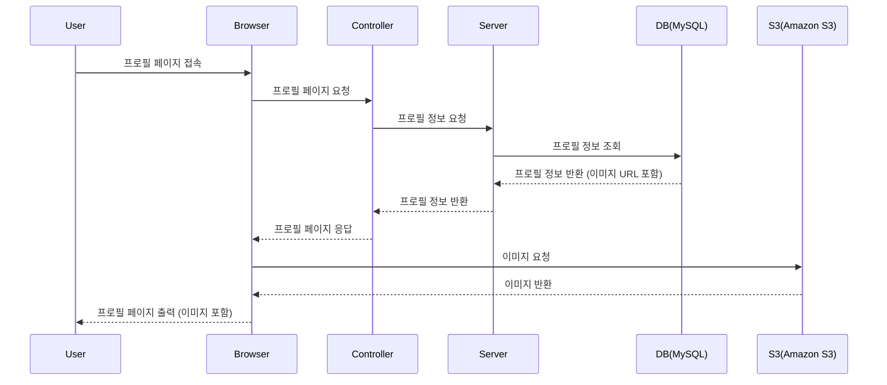

<br/>

### profile - 프로필 업데이트

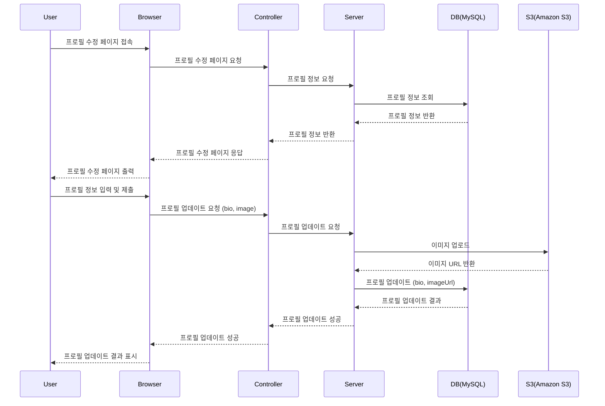

<br/><br/>

## Friend

### Friend - 친구 요청 보내기

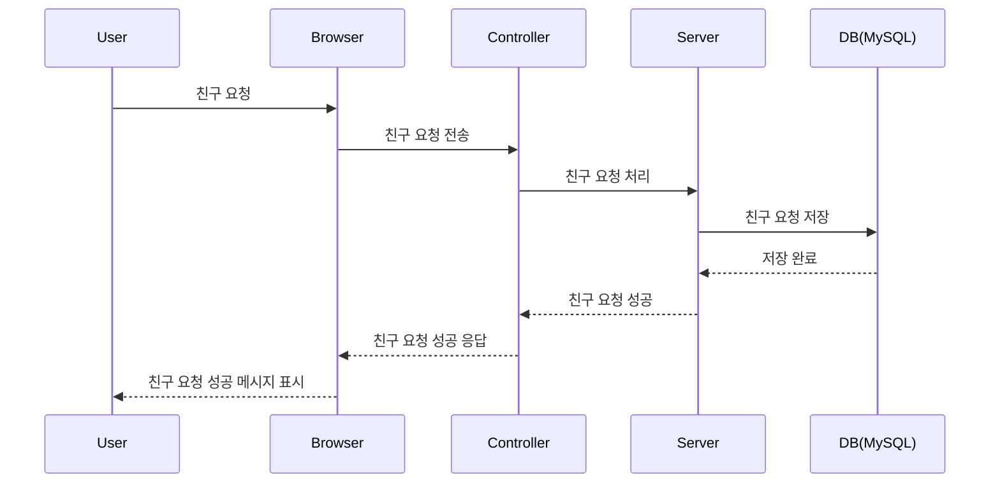

<br/>

### Friend - 받은 친구 요청 목록 조회

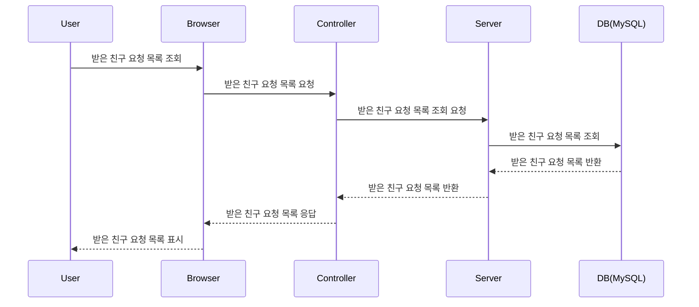

<br/>

### Friend - 친구 요청 수락


### Friend - 친구 관계 ID 찾기

<br/>

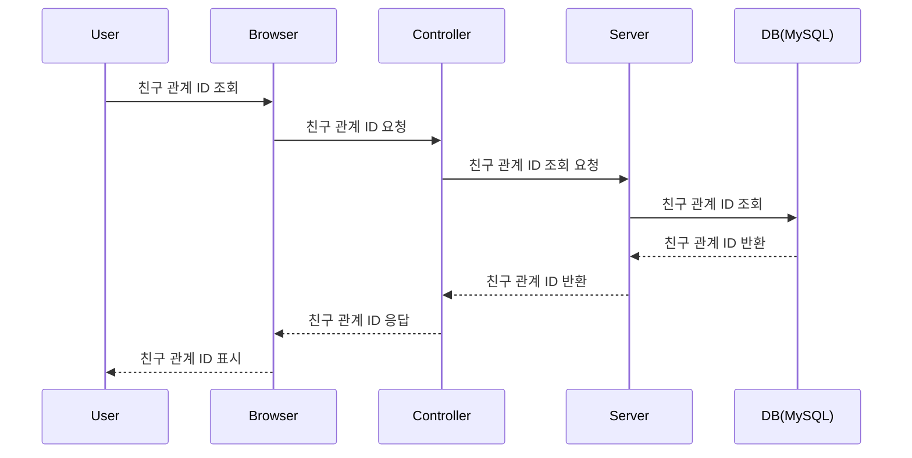


<br/>

### Friend - 친구 요청 거절

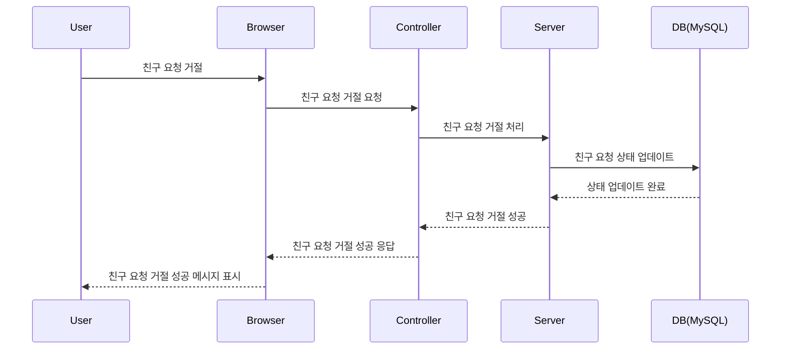


<br/>

### Friend - 친구 끊기

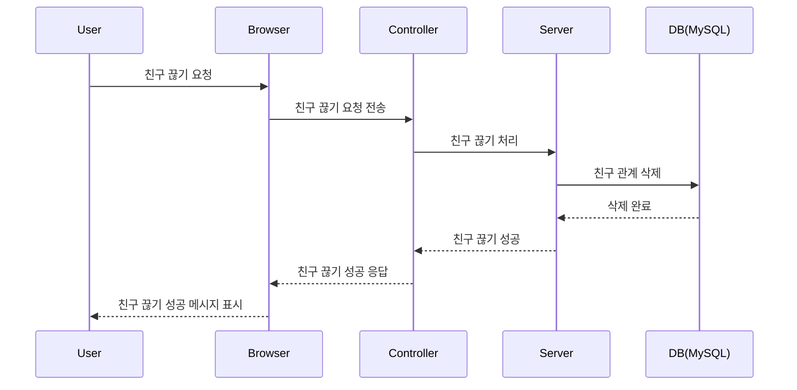

<br/><br/>

## studygroup

### studygroup - 스터디 그룹 생성

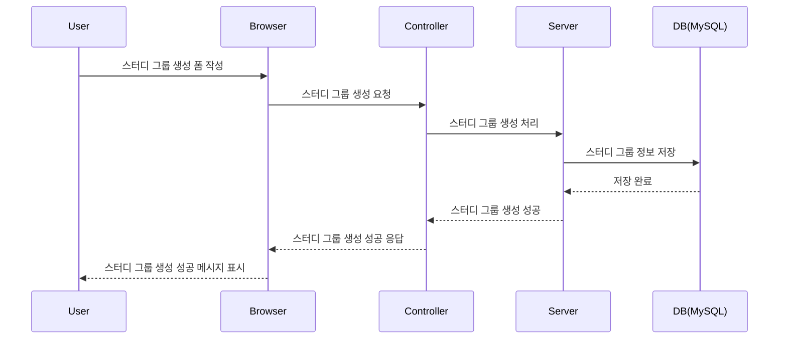

<br/>

### studygroup - 스터디 그룹 가입 요청

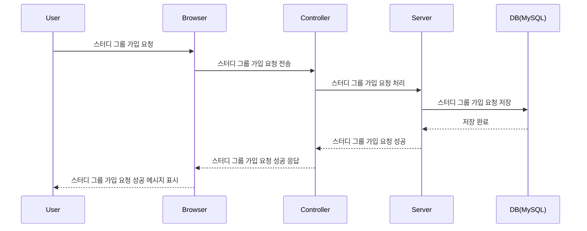

<br/>

### studygroup - 스터디 그룹 가입 요청 수락/거절

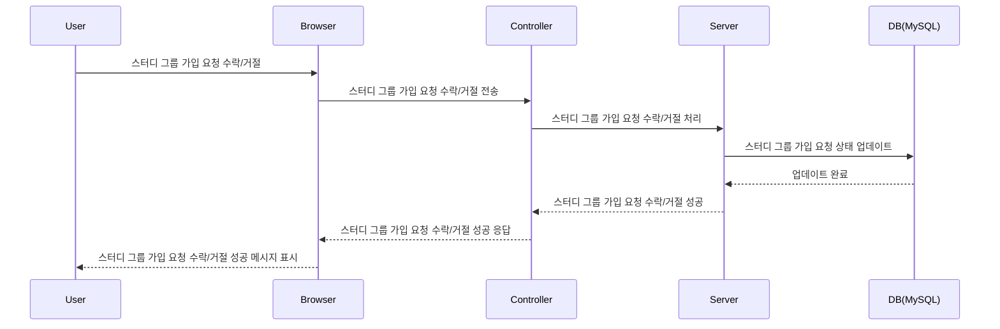


<br/>

### studygroup - 스터디 그룹 탈퇴

```mermaid
sequenceDiagram
    participant User
    participant Browser
    participant Controller
    participant Server
    participant DB(MySQL)

    User->>Browser: 스터디 그룹 탈퇴 요청
    Browser->>Controller: 스터디 그룹 탈퇴 요청 전송
    Controller->>Server: 스터디 그룹 탈퇴 처리
    Server->>DB(MySQL): 스터디 그룹 정보 삭제
    DB(MySQL)-->>Server: 삭제 완료
    Server-->>Controller: 스터디 그룹 탈퇴 성공
    Controller-->>Browser: 스터디 그룹 탈퇴 성공 응답
    Browser-->>User: 스터디 그룹 탈퇴 성공 메시지 표시
```


<br/><br/>

## groupfeed

### groupfeed - 그룹 피드 생성

```mermaid
sequenceDiagram
    participant User
    participant Browser
    participant Controller
    participant Server
    participant DB(MySQL)

    User->>Browser: 피드 작성 화면 접속
    Browser->>Controller: 피드 작성 화면 요청
    Controller->>Server: 사용자 정보 요청
    Server->>DB(MySQL): 사용자 정보 조회
    DB(MySQL)-->>Server: 사용자 정보 반환
    Server-->>Controller: 사용자 정보 반환
    Controller-->>Browser: 피드 작성 화면 데이터 반환
    Browser-->>User: 피드 작성 화면 출력
    User->>Browser: 피드 작성 정보 입력
    Browser->>Controller: 피드 생성 요청
    Controller->>Server: 피드 생성 요청
    Server->>DB(MySQL): 사용자 정보 확인
    DB(MySQL)-->>Server: 사용자 정보 반환
    Server->>DB(MySQL): 피드 정보 저장
    DB(MySQL)-->>Server: 피드 정보 저장 결과
    Server-->>Controller: 피드 생성 성공
    Controller-->>Browser: 피드 생성 성공
    Browser-->>User: 피드 생성 성공 알림
```


<br/>

### groupfeed - 그룹 피드 댓글 작성

```mermaid
sequenceDiagram
    participant User
    participant Browser
    participant Controller
    participant Server
    participant DB(MySQL)

    User->>Browser: 피드 상세 보기 접속
    Browser-->>User: 피드 상세 정보 출력
    User->>Browser: 댓글 입력
    Browser->>Controller: 댓글 작성 요청
    Controller->>Server: 댓글 작성 요청
    Server->>DB(MySQL): 사용자 정보 확인
    DB(MySQL)-->>Server: 사용자 정보 반환
    Server->>DB(MySQL): 댓글 정보 저장
    DB(MySQL)-->>Server: 댓글 정보 저장 결과
    Server-->>Controller: 댓글 작성 성공
    Controller-->>Browser: 댓글 작성 성공
    Browser-->>User: 댓글 작성 성공 알림
```


<br/>

### groupfeed - 그룹 피드 좋아요 토글

```mermaid
sequenceDiagram
    participant User
    participant Browser
    participant Controller
    participant Server
    participant DB(MySQL)

    User->>Browser: 피드 상세 보기 접속
    Browser-->>User: 피드 상세 정보 출력
    User->>Browser: 좋아요 버튼 클릭
    Browser->>Controller: 좋아요 토글 요청
    Controller->>Server: 좋아요 토글 요청
    Server->>DB(MySQL): 사용자 정보 확인
    DB(MySQL)-->>Server: 사용자 정보 반환
    Server->>DB(MySQL): 기존 좋아요 확인
    DB(MySQL)-->>Server: 좋아요 상태 반환
    alt 좋아요가 이미 존재함
        Server->>DB(MySQL): 좋아요 삭제
        DB(MySQL)-->>Server: 좋아요 삭제 결과
    else 좋아요가 없음
        Server->>DB(MySQL): 좋아요 추가
        DB(MySQL)-->>Server: 좋아요 추가 결과
    end
    Server->>DB(MySQL): 좋아요 통계 업데이트
    DB(MySQL)-->>Server: 통계 업데이트 결과
    Server-->>Controller: 좋아요 토글 성공
    Controller-->>Browser: 좋아요 토글 성공
    Browser-->>User: 좋아요 토글 성공 알림
```


